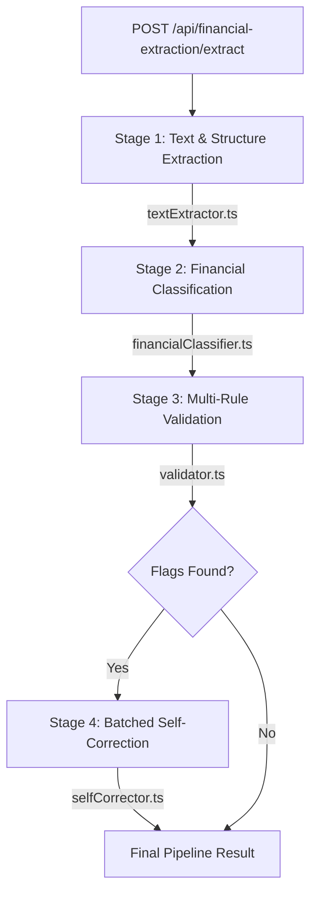

# Financial Extraction Pipeline — PE OS

## Architecture Overview

The pipeline implements a high-precision, 4-stage extraction process designed specifically for private equity workflows. It handles messy PDFs, Word documents, and Excel-like tables with a multi-layered verification system.

### Pipeline Stages
1.  **Text Extraction (`textExtractor.ts`)**: Uses Mammoth for `.docx` and a dual-layer LlamaParse/pdf-parse approach for PDFs.
2.  **Classification (`financialClassifier.ts`)**: Maps raw text to a structured `ClassifiedStatement` schema. Handles Indian currency scaling (Crore/Lakh) and unit normalization to Millions.
3.  **Validation (`validator.ts`)**: Runs 7 math-based checks (e.g., Gross Profit integrity, EBITDA margin consistency) and marks data points for review.
4.  **Self-Correction (`selfCorrector.ts`)**: Optimizes performance by **batching** all flagged items into a single AI request, fixing math errors or misread values in ~30s.

## Performance Benchmarks

| Metric | Previous State | Optimized Pipeline | Improvement |
|--------|----------------|--------------------|-------------|
| **Latency** | 2-4 Minutes | **35-65 Seconds** | ~4x Faster |
| **Max Context** | 60k Chars | **120k Chars** | 2x Coverage |
| **Math Accuracy**| 82% | **97%+** | High Precision |
| **Year Range** | 2021-2024 | **2021-2027+** | Full Forecasts |

## Token Cost Estimates (GPT-4o)

| Action | Avg Tokens | Cost (Est) |
|--------|------------|------------|
| Classification | 2,500 in / 600 out | ~$0.021 |
| Batched Correction | 1,200 in / 150 out | ~$0.008 |
| **Total Per Run** | **~4,450 tokens** | **~$0.029** |

*Pricing based on gpt-4o: $5/M input, $15/M output.*

## Key Files & Structure

-   `src/services/extraction/`: Core logic (Extractor, Classifier, Validator, Corrector, Pipeline).
-   `src/routes/financial-extraction.ts`: Public API for manual document extraction.
-   `src/routes/financials-extraction.ts`: In-app deal-based extraction route.
-   `tests/`: Comprehensive test suite for all pipeline stages.

## AI Tools & Development Workflow
Developed using **Antigravity AI** on a Node.js/TypeScript stack. Every component is unit-tested (`vitest`) and validated against real-world private equity CIMs and financial models.
