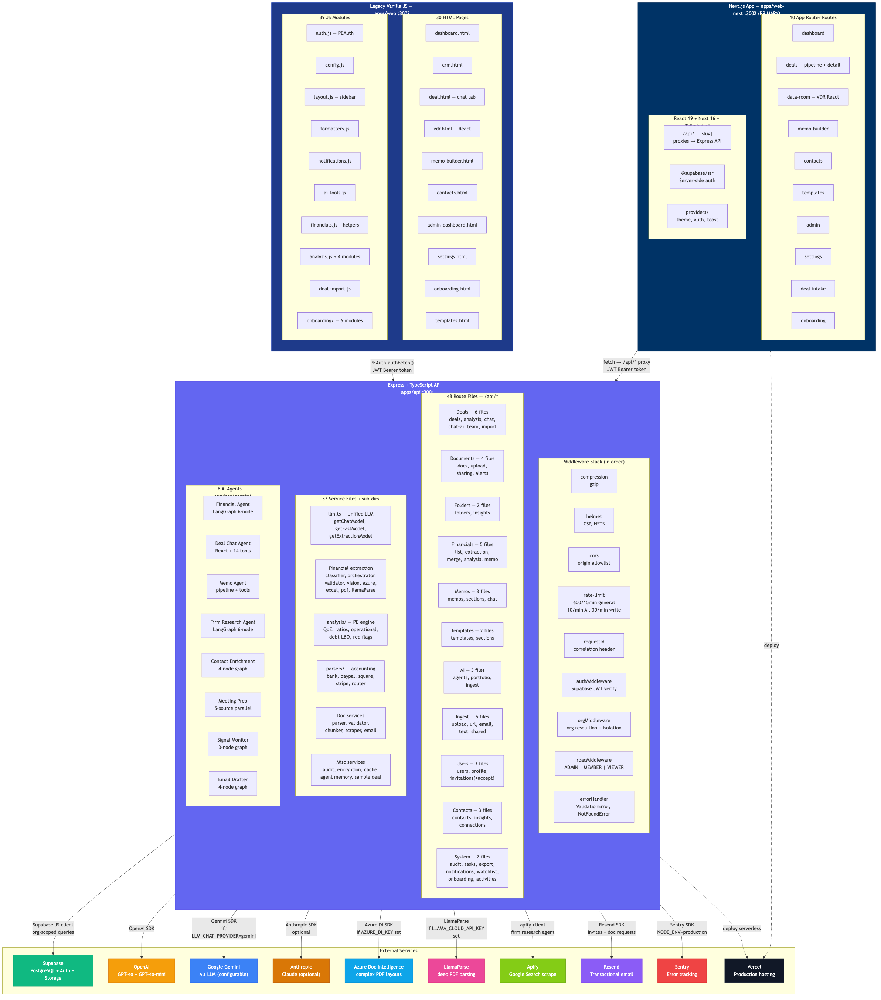
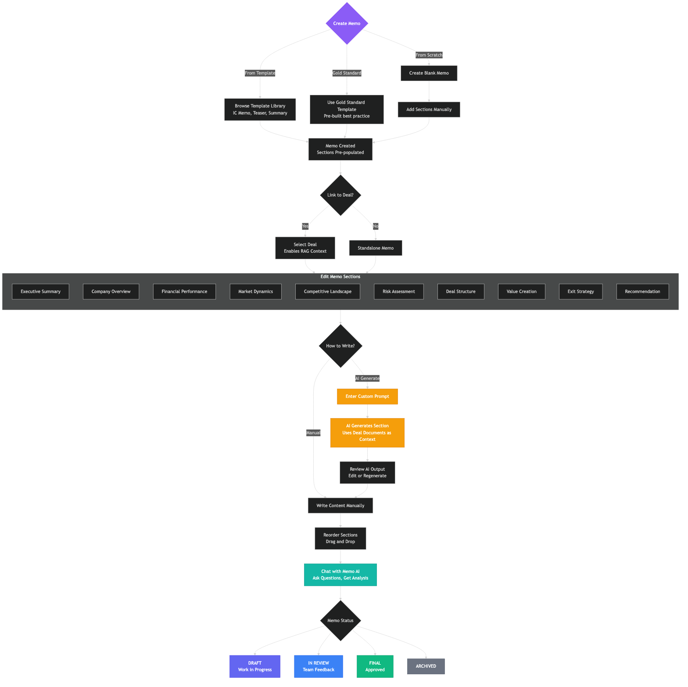
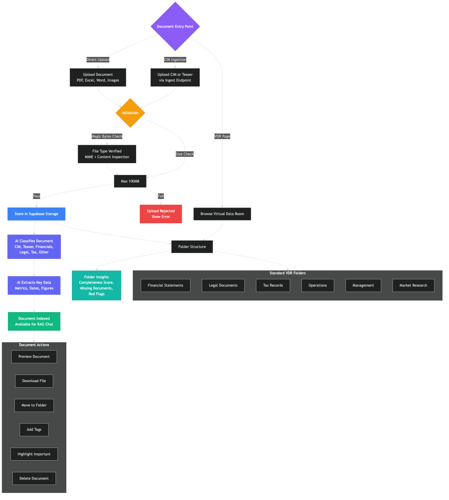

# PE OS — AI-Native Deal CRM

A modern, AI-powered CRM for Private Equity firms to manage deal flow, track opportunities, and analyze investments with artificial intelligence.

**Production:** https://pe-os.onrender.com

---

### System Architecture
<p align="center">
  
</p>

### AI Memo Builder Flow
<p align="center">
  
</p>

### Document & Virtual Data Room Flow
<p align="center">
  
</p>

> See all 10 diagrams in [`docs/diagrams/`](docs/diagrams/) — includes Auth Flow, Deal Lifecycle, ER Diagram, Role Matrix, User Journeys, and Navigation Flow.

---

## Documentation

| Guide | Description |
|-------|-------------|
| [Environment Setup](docs/ENVIRONMENT_SETUP.md) | All environment variables explained |
| [Deployment](docs/DEPLOYMENT.md) | Render deployment runbook |
| [Troubleshooting](docs/TROUBLESHOOTING.md) | Common issues and fixes |
| [Architecture](docs/ARCHITECTURE.md) | System architecture |
| [API Reference](docs/API.md) | API endpoints |
| [Security](docs/SECURITY.md) | Security considerations |

## Features

- **Deal Pipeline Management** — Track deals across stages (Initial Review → Due Diligence → IOI → LOI → Negotiation → Closing)
- **AI-Powered Insights** — GPT-4 analysis, thesis generation, and deal chat
- **Document Intelligence** — Upload and process CIMs, teasers, financials with magic-bytes validation
- **Investment Memo Builder** — Template-based memos with AI-generated sections
- **Virtual Data Room** — Folder-based document management with access controls
- **Role-Based Access** — ADMIN / MEMBER / VIEWER roles with permission-gated features
- **Team Collaboration** — Invite team members, assign deals, share documents
- **Real-time Dashboard** — Live metrics and KPIs for your portfolio
- **Error Tracking** — Sentry integration for both frontend and backend
- **Rate Limiting** — Tiered rate limits (general, AI, write operations)

## Tech Stack

**Frontend:** HTML5, Vanilla JavaScript, Tailwind CSS, Vite
**Backend:** Node.js, Express, TypeScript, Zod validation
**Database:** Supabase (PostgreSQL + Auth + Storage)
**AI:** OpenAI GPT-4, Google Gemini (RAG)
**Infrastructure:** Turborepo, Render.com, Sentry
**Testing:** Vitest, Supertest

## Project Structure

```
AI CRM/
├── apps/
│   ├── web/                     # Frontend (Vite + vanilla JS)
│   │   ├── index.html           # Landing page
│   │   ├── dashboard.html       # Main dashboard
│   │   ├── crm.html             # Deal pipeline
│   │   ├── deal.html            # Deal detail / AI chat
│   │   ├── memo-builder.html    # Investment memo builder
│   │   ├── admin-dashboard.html # Admin panel
│   │   ├── js/                  # JavaScript modules
│   │   └── vite.config.ts       # Vite config (env injection, Sentry)
│   └── api/                     # Backend (Express + TypeScript)
│       ├── src/
│       │   ├── index.ts         # Server entry point
│       │   ├── middleware/       # Auth, RBAC
│       │   ├── routes/          # API routes
│       │   ├── services/        # Business logic (audit, file validation, AI)
│       │   └── utils/           # Logger, helpers
│       ├── tests/               # Vitest test suite
│       └── package.json
├── packages/
│   ├── shared/                  # Shared TypeScript types
│   └── ui/                      # Shared UI components
├── render.yaml                  # Render deployment blueprint
├── turbo.json                   # Turborepo config
└── package.json                 # Root workspace config
```

## Quick Start

### Prerequisites

- Node.js >= 18
- npm >= 10
- A [Supabase](https://supabase.com) project

### 1. Install dependencies

```bash
git clone <repository-url>
cd "AI CRM"
npm install
```

### 2. Configure environment

```bash
# Backend
cp apps/api/.env.example apps/api/.env
# Edit apps/api/.env with your Supabase URL, anon key, and API keys

# Frontend
cp apps/web/.env.example apps/web/.env
# Edit apps/web/.env with your Supabase URL and anon key
```

See [Environment Setup](docs/ENVIRONMENT_SETUP.md) for all variables.

### 3. Run locally

```bash
npm run dev
```

- **Frontend:** http://localhost:3000
- **API:** http://localhost:3001
- **Health check:** http://localhost:3001/health
- **Readiness check:** http://localhost:3001/health/ready

### 4. Run tests

```bash
cd apps/api
npm test              # Run all tests
npm run test:coverage # Run with coverage report
```

## API Overview

All API routes are under `/api/` and require authentication (Bearer token) unless noted.

| Resource | Endpoints |
|----------|-----------|
| Deals | `GET/POST /api/deals`, `GET/PATCH/DELETE /api/deals/:id`, `GET /api/deals/stats/summary` |
| Companies | `GET/POST /api/companies`, `GET/PATCH/DELETE /api/companies/:id` |
| Documents | `GET /api/deals/:id/documents`, `POST /api/deals/:id/documents/upload` |
| Memos | `GET/POST /api/memos`, `GET/PATCH /api/memos/:id` |
| Templates | `GET/POST /api/templates`, `PATCH/DELETE /api/templates/:id` |
| Users | `GET /api/users`, `GET/PATCH /api/users/me` |
| AI Chat | `POST /api/deals/:id/chat`, `GET /api/deals/:id/chat/history` |
| Notifications | `GET /api/notifications`, `POST /api/notifications/mark-all-read` |
| Invitations | `POST /api/invitations`, `GET /api/invitations/verify/:token` |

See [API Reference](docs/API.md) for full documentation.

## Scripts

| Command | Description |
|---------|-------------|
| `npm run dev` | Start all services (Turborepo) |
| `npm run dev:web` | Start frontend only |
| `npm run dev:api` | Start API only |
| `npm run build` | Build all packages |
| `npm run build:prod` | Build web + API for production |
| `npm run start:prod` | Start production server |
| `cd apps/api && npm test` | Run API tests |
| `cd apps/api && npm run test:coverage` | Run tests with coverage |

## Deployment

Deployed on **Render.com** with automatic deploys from the `main` branch.

```bash
# Build
npm ci --include=dev && npm run build:prod

# Start
NODE_ENV=production node apps/api/dist/index.js
```

See [Deployment Guide](docs/DEPLOYMENT.md) for full runbook.

## License

Private and confidential.

---

**Last Updated:** February 13, 2026
