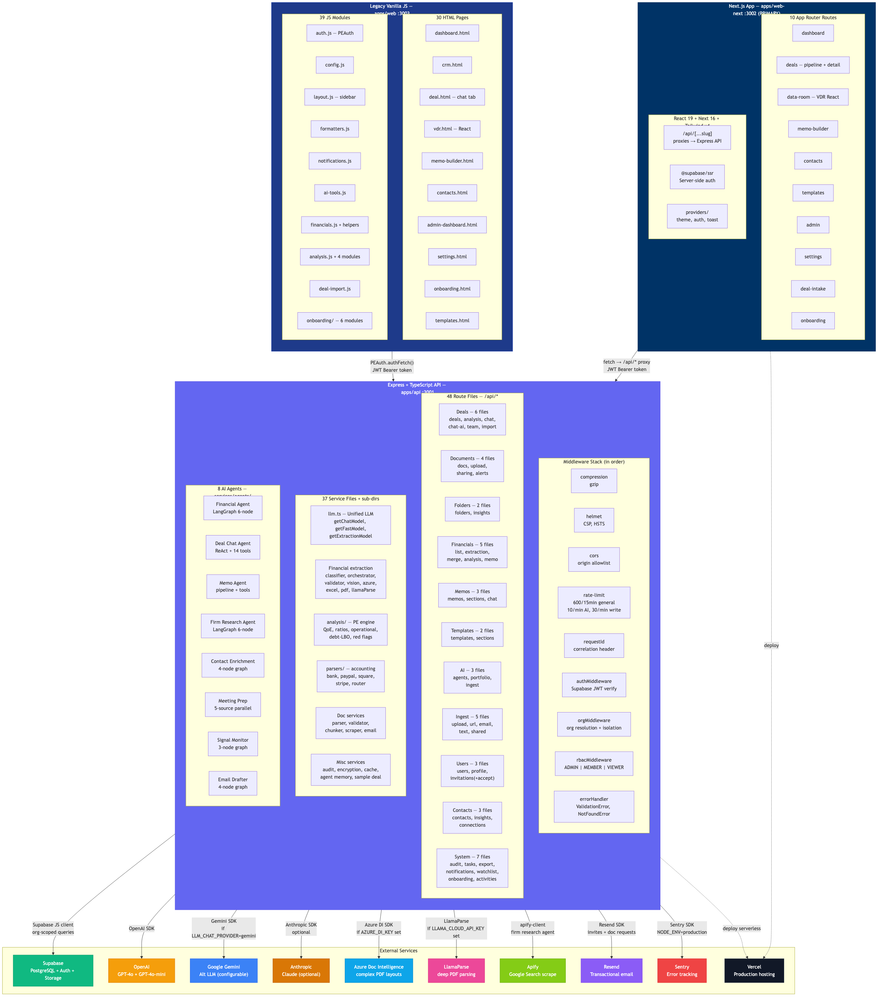

# System Architecture — Overview

> **Audience:** Engineers joining the team. Read this once; you'll know what every directory does.
> **Last verified:** 2026-04-29 against the live codebase.

PE OS is a multi-tenant AI-native CRM for private-equity firms. It is a Turborepo monorepo with **two frontends** (a Next.js 16 app that is the primary product surface and a legacy vanilla JS app being migrated away from) and **one Express API** backed by Supabase.

## Top-down picture



Source: [`docs/diagrams/08-system-architecture.mmd`](../diagrams/08-system-architecture.mmd)

## Repository layout

```
AI CRM/
├── apps/
│   ├── api/         Express + TypeScript (port 3001) — the only backend
│   ├── web-next/    Next.js 16 + React 19 + Tailwind v4 (port 3002) — PRIMARY
│   ├── web/         Legacy Vite + vanilla JS (port 3003) — being migrated
│   └── extractor/   Standalone extraction utility
├── packages/
│   ├── ui/          Shared React components / styles
│   └── shared/      Shared TypeScript types (legacy)
├── docs/            All documentation (this folder)
├── scripts/         Repo helpers
└── turbo.json       Turborepo task pipeline
```

Port assignments are deliberate so multiple worktrees can run side-by-side:

| Port | Owner | Notes |
| --- | --- | --- |
| 3000 | Reserved | Main-branch worktree of legacy `apps/web` (Vite default) |
| 3001 | `apps/api` | Express API |
| 3002 | `apps/web-next` | Next.js — primary frontend |
| 3003 | `apps/web` | Legacy Vite — secondary frontend |

## The two frontends

We are mid-migration. Both apps point at the same Express API.

**`apps/web-next` (primary).** Next.js 16 App Router. Route groups split surfaces:

- `(auth)/` — login, signup, verify-email, forgot/reset password, accept-invite
- `(onboarding)/` — standalone onboarding flow with no app chrome
- `(app)/` — authenticated routes: dashboard, deals, data-room, memo-builder, contacts, templates, admin, settings, deal-intake, coming-soon
- `api/[...slug]/route.ts` — catch-all proxy that forwards `/api/*` calls to the Express backend, preserving the `Authorization` header. This means web-next can be deployed standalone on Vercel and still talk to a separately-hosted API.

See [`18-webnext-architecture.mmd`](../diagrams/18-webnext-architecture.mmd) for the full layout.

**`apps/web` (legacy).** Multi-page vanilla JS app. 30 HTML pages, 39 shared JS modules. New work should not be added here unless it's a hotfix for a page that hasn't been migrated. The VDR sub-app is the one piece that is React (Vite-built) and is reused inside web-next.

Shared modules in `apps/web/js/` must load in this order:

1. `auth.js` — Supabase auth + `PEAuth` singleton
2. `config.js` — `API_BASE_URL` + `PE_CONFIG`
3. `formatters.js` — `formatCurrency`, `formatFileSize`, `escapeHtml`
4. `notifications.js` — `showNotification(title, message, type)`
5. `layout.js` — sidebar + header injection

Never define `API_BASE_URL`, `showNotification`, or `formatCurrency` inline — they live in shared modules. Use `PEAuth.authFetch()` for every API call so token refresh is handled.

## The API

Single Express app entrypoint at [`apps/api/src/app.ts`](../../apps/api/src/app.ts). Every request flows through the same middleware stack in this order:

1. `compression` (gzip)
2. `helmet` (CSP, HSTS)
3. `cors` (origin allowlist + Vercel preview-domain regex)
4. `express-rate-limit` — three buckets keyed by user (Bearer token suffix) or IP:
   - General `/api/`: 600 / 15 min
   - `/api/ai`: 10 / min (expensive calls)
   - `/api/ingest`: 30 / min (writes)
   - Memo AI subroutes share the AI bucket
5. `requestIdMiddleware` — correlation header for tracing
6. `authMiddleware` — verifies Supabase JWT, sets `req.authId`
7. `orgMiddleware` — resolves the caller's `organizationId`, stamps `req.organizationId`, `req.userId`, `req.userRole`
8. `rbacMiddleware` (route-level) — gates ADMIN-only operations
9. `errorHandler` — converts `ValidationError`, `NotFoundError`, etc. to JSON responses; integrates Sentry

48 route files live in [`apps/api/src/routes/`](../../apps/api/src/routes/). They are intentionally thin — validate input, call services, return JSON. Business logic lives in [`apps/api/src/services/`](../../apps/api/src/services/) (37 top-level files plus three sub-directories: `agents/`, `analysis/`, `parsers/`).

**Public routes** (no auth):

- `/health`, `/health/ready` — liveness + readiness with DB/OpenAI/Sentry checks
- `/api/public/invitations/*` — invitees don't have accounts yet
- `/api/ai/status` — exposes whether AI is configured

Everything else under `/api/*` requires auth + org resolution.

## Multi-tenancy

Every row is owned by an `Organization`. There are two scoping patterns:

- **Direct scoping** (10 tables): `organizationId` is a column. Queries filter `.eq('organizationId', orgId)`. Tables: `User`, `Deal`, `Company`, `Contact`, `Task`, `Memo`, `MemoTemplate`, `Invitation`, `AuditLog`, `Notification`.
- **Indirect scoping via Deal** (10 tables): no `organizationId` column. Access is verified by walking up to the parent `Deal` and confirming it belongs to the calling org. Helpers: `verifyDealAccess`, `verifyContactAccess`, `verifyDocumentAccess`, `verifyFolderAccess`, `verifyConversationAccess` in [`middleware/orgScope.ts`](../../apps/api/src/middleware/orgScope.ts).

All 48 route files apply one of these patterns. Cross-org access returns **404** (not 403) to prevent ID enumeration. There are 34 integration tests in [`apps/api/tests/org-isolation.test.ts`](../../apps/api/tests/org-isolation.test.ts) — 26 cross-org-blocked + 8 same-org-works.

See [`13-multi-tenancy-org-isolation.mmd`](../diagrams/13-multi-tenancy-org-isolation.mmd) and [`security.md`](./security.md).

## AI layer

The API uses **eight LangGraph / ReAct agents** that all route through one unified LLM client at [`services/llm.ts`](../../apps/api/src/services/llm.ts). Every call through that client — and through the raw OpenAI, Anthropic, Apify, Azure DocIntel, and Gemini embedding paths — is attributed to a specific User and Organization by the **AI Usage Tracking** system (shipped May 2026). Internal admins can inspect consumption at `/internal/usage`; users see a passive credit meter in Settings → AI Usage. See [`docs/AI-USAGE-TRACKING.md`](../AI-USAGE-TRACKING.md) for architecture, code map, runbook, and the five bugs that were fixed in production.

- `getChatModel()` — GPT-4o for reasoning
- `getFastModel()` — GPT-4o-mini for verification and classification (cheaper)
- `getExtractionModel()` — GPT-4o tuned for structured JSON output
- Gemini and Anthropic are wired in as alternatives controlled by `LLM_CHAT_PROVIDER`

The agents:

| Agent | Type | Purpose | File |
| --- | --- | --- | --- |
| Financial Agent | LangGraph 6-node | Extract → verify → cross-verify → validate → self-correct → store | [`agents/financialAgent/`](../../apps/api/src/services/agents/financialAgent/) |
| Deal Chat | ReAct + 14 tools | Conversational deal Q&A with read/write/trigger/UI tools | [`agents/dealChatAgent/`](../../apps/api/src/services/agents/dealChatAgent/) |
| Memo Agent | Pipeline | Section-by-section IC memo generation | [`agents/memoAgent/`](../../apps/api/src/services/agents/memoAgent/) |
| Firm Research | LangGraph 6-node | Onboarding firm enrichment + deep research | [`agents/firmResearchAgent/`](../../apps/api/src/services/agents/firmResearchAgent/) |
| Contact Enrichment | 4-node graph | Enrich contact records with confidence scoring | [`agents/contactEnrichment/`](../../apps/api/src/services/agents/contactEnrichment/) |
| Meeting Prep | Parallel fetcher | Generate prep brief from 5 sources | [`agents/meetingPrep/`](../../apps/api/src/services/agents/meetingPrep/) |
| Signal Monitor | 3-node graph | Portfolio risk scan, severity-routed | [`agents/signalMonitor/`](../../apps/api/src/services/agents/signalMonitor/) |
| Email Drafter | 4-node graph | Draft → tone-check → compliance → finalize | [`agents/emailDrafter/`](../../apps/api/src/services/agents/emailDrafter/) |

See [`12-ai-agents-architecture.mmd`](../diagrams/12-ai-agents-architecture.mmd) and [`ai-agents.md`](./ai-agents.md).

## Data layer

Supabase Postgres with ~25 tables. The full ER diagram is at [`07-er-diagram.mmd`](../diagrams/07-er-diagram.mmd). High-level concept map:

```
Organization ──┬── User ──── DealTeamMember ─── Deal
               ├── Deal ─── Company
               ├── Deal ─── Document ─── DocumentChunk
               ├── Deal ─── Folder ─── FolderInsight
               ├── Deal ─── FinancialStatement
               ├── Deal ─── ChatMessage
               ├── Deal ─── Activity
               ├── Deal ─── Memo ─── MemoSection
               ├── Contact ─── ContactInteraction
               ├── Contact ─── ContactDeal ─── Deal
               ├── Task
               ├── MemoTemplate
               ├── Invitation
               ├── AuditLog
               ├── Notification
               ├── AgentMemoryIndustry
               └── AgentMemoryExtraction
```

A few specific constraints worth knowing up front:

- `FinancialStatement.extractionSource` CHECK constraint allows only `'gpt4o'`, `'azure'`, `'vision'`, `'manual'`. Don't introduce compound values like `'gpt4o-excel'`.
- `FinancialStatement.statementType` CHECK constraint allows only `'INCOME_STATEMENT'`, `'BALANCE_SHEET'`, `'CASH_FLOW'`. The classifier normalizes variants (`P_AND_L`, `CASH_FLOW_STATEMENT`, etc.).
- A **partial unique index** `WHERE isActive = true` enforces one active row per `(dealId, statementType, period)`. The DB itself prevents duplicates — this is not application logic.
- Financial values are stored in **millions USD**.

See [`data-model.md`](./data-model.md) for the full schema breakdown.

## External services

| Service | Purpose | Required? | Env var |
| --- | --- | --- | --- |
| Supabase | Postgres + Auth + Storage | yes | `SUPABASE_URL`, `SUPABASE_ANON_KEY`, `SUPABASE_SERVICE_ROLE_KEY` |
| OpenAI | GPT-4o + GPT-4o-mini | yes (for AI features) | `OPENAI_API_KEY` |
| Google Gemini | Alt LLM | optional | `GEMINI_API_KEY`, `LLM_CHAT_PROVIDER=gemini` |
| Anthropic | Optional Claude support | optional | `ANTHROPIC_API_KEY` |
| Azure Document Intelligence | Best for complex CIM PDFs | optional fallback | `AZURE_DI_KEY`, `AZURE_DI_ENDPOINT` |
| LlamaParse | Deep PDF parsing | optional fallback | `LLAMA_CLOUD_API_KEY` |
| Apify | Google Search scraping for firm research agent | optional | `APIFY_API_TOKEN` |
| Resend | Transactional email (invites, doc requests) | yes in prod | `RESEND_API_KEY` |
| Sentry | Error tracking | yes in prod | `SENTRY_DSN` |
| Vercel | Production hosting (frontend + serverless API) | — | — |

Health check at `GET /health/ready` reports which optional services are configured.

## Deployment

Production runs on **Vercel** as a single deployment with the API as serverless functions and Next.js for the frontend. The legacy `apps/web` is also bundled. Render is the previous host and is no longer used.

Key build commands (from [`package.json`](../../package.json)):

- `npm run dev` — Turborepo runs every app together
- `npm run dev:api` / `dev:web` / `dev:web-next` — single app
- `npm run build` — Turborepo builds all packages
- `npm run build:prod` — production bundle
- `cd apps/api && npm test` — Vitest suite
- `cd apps/api && npm run test:org-isolation` — multi-tenancy tests

## Where to dig next

- [`data-model.md`](./data-model.md) — every table and relationship
- [`api-routes.md`](./api-routes.md) — all 48 route files mapped
- [`ai-agents.md`](./ai-agents.md) — each agent in detail
- [`security.md`](./security.md) — auth, RBAC, org isolation, rate limits
- [`../user-flows/`](../user-flows/) — end-to-end flows (signup, deal-import, financial extraction, …)
- [`../features/`](../features/) — product documentation per feature
- [`../onboarding/new-teammate-guide.md`](../onboarding/new-teammate-guide.md) — start here on day one
