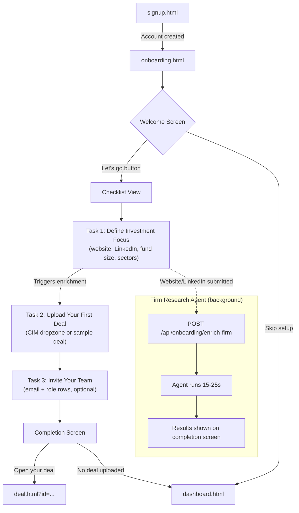
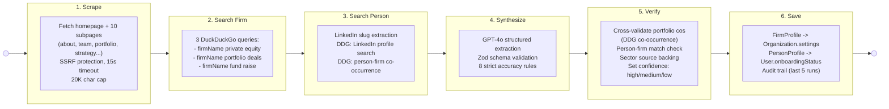
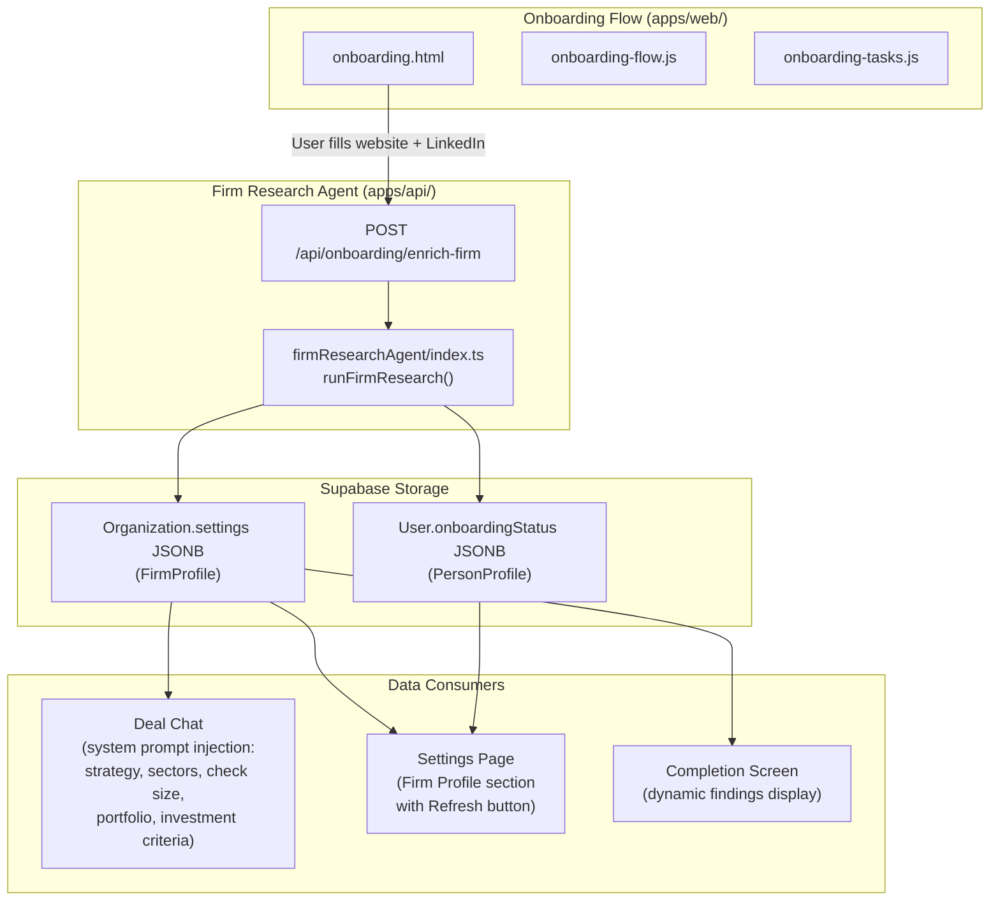

# PE OS -- Onboarding & Firm Research Agent Architecture

## 1. User Flow: Signup to Dashboard

**Key points:**
- New users land on `onboarding.html` after signup (dashboard.html checks onboarding status and redirects).
- Welcome screen is a 2-column layout: hero text on the left, checklist preview on the right.
- The 3-task checklist is sequential. Task 3 (Invite Team) is optional and can be skipped.
- Completion screen shows dynamic findings from the firm research agent (sectors, fund size, portfolio companies). If the agent is still running, it shows a "processing" state.
- Confetti animation plays on completion. User is redirected to their deal page or dashboard.
- Returning users who completed onboarding are never shown the flow again.

---

## 2. Firm Research Agent: LangGraph Pipeline

**Data flow through the pipeline:**

| State Field | Written By | Read By |
|---|---|---|
| `websiteText` | scrape | synthesize |
| `firmSearchResults` | searchFirm | synthesize, verify |
| `personSearchResults` | searchPerson | synthesize, verify |
| `firmProfile` | synthesize | verify, save |
| `personProfile` | synthesize | verify, save |
| `sources` | synthesize | save |
| `steps` | all nodes (append-only) | returned to caller |
| `status` | save | returned to caller |

---

## 3. System Integration: Where Enriched Data Flows

**Integration points:**

1. **Onboarding flow** -- Task 1 triggers enrichment when the user submits their website/LinkedIn URL. Results appear on the completion screen.
2. **Deal Chat** -- The firm profile is injected into the deal chat system prompt, giving the AI context about the firm's strategy, target sectors, check size, portfolio, and investment criteria. Users can ask "does this deal match our criteria?" and get informed answers.
3. **Settings page** -- A "Firm Profile" section displays the enriched data with a "Refresh" button that re-runs the agent.

---

## File Map

| Component | Files |
|---|---|
| Onboarding frontend | `apps/web/onboarding.html`, `apps/web/onboarding-flow.js`, `apps/web/onboarding-tasks.js` |
| Signup page | `apps/web/signup.html` |
| Agent entry point | `apps/api/src/services/agents/firmResearchAgent/index.ts` |
| Agent graph | `apps/api/src/services/agents/firmResearchAgent/graph.ts` |
| Agent state | `apps/api/src/services/agents/firmResearchAgent/state.ts` |
| Agent nodes | `apps/api/src/services/agents/firmResearchAgent/nodes/{scrape,searchFirm,searchPerson,synthesize,verify,save}.ts` |
| Web search util | `apps/api/src/services/webSearch.ts` |
| API route | Mounted under `/api/onboarding/` |
