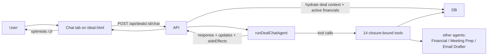

# Flow — Deal Chat

Conversational chat tab on the deal page. Backed by a ReAct agent with 14 tools that already know the current `dealId` and `orgId`.

See the full mermaid sequence at [`docs/diagrams/19-deal-chat-react-agent.mmd`](../diagrams/19-deal-chat-react-agent.mmd).

## High-level

## What the user sees

- A chat bubble on the right rail of `/deal.html` (legacy) or in the `(app)/deals/[dealId]/chat` route (web-next).
- Resizable side panel.
- Chat persists per-deal in `ChatMessage` rows (last 10 included as history).
- Inline updates ("EBITDA changed to $12.4M") show as system-style messages when the agent uses a write tool.
- Side-effects: `scroll_to_section` smooth-scrolls the page; `extraction_triggered` shows a progress strip.

## What the system does

1. **Frontend** posts `{ message, history }` to `/api/deals/:id/chat`.
2. **Express route** ([`deals-chat-ai.ts`](../../apps/api/src/routes/deals-chat-ai.ts)) does `verifyDealAccess`, hydrates the deal context (basic metadata + a markdown table of active financial statements), and calls `runDealChatAgent()`.
3. **The agent** ([`agents/dealChatAgent/index.ts`](../../apps/api/src/services/agents/dealChatAgent/index.ts)) builds a ReAct loop with:
   - System prompt defining the analyst persona, the **Financial Data Protocol** (must quote exact numbers, never hallucinate), and the tool catalog.
   - A second system message with the deal context.
   - Last 10 messages of history.
   - The user message.
4. **Tools** are bound via `getDealChatTools(dealId, orgId)` — 14 closure-bound LangChain tools so the model can't pass an arbitrary deal id and read someone else's data.
5. **Tool message scan** — after the agent finishes, the route inspects every tool message JSON output:
   - `success: true, field: "..."` → push to `updates[]`
   - `type: "...", url: "..."` → set `action`
   - `type` ∈ `{note_added, extraction_triggered, scroll_to}` → push to `sideEffects[]`
6. **Response** is `{ response, model, updates?, action?, sideEffects? }`.

## Tool catalog (14)

| Group | Tool | Effect |
| --- | --- | --- |
| Read | `search_documents` | Full-text search of VDR for this deal |
| Read | `get_deal_financials` | Fetches active + inactive `FinancialStatement` rows |
| Read | `compare_deals` | Cross-deal comparison (pass `targetDealName` for specific) |
| Read | `get_deal_activity` | Activity timeline |
| Read | `get_analysis_summary` | QoE + ratios + red flags |
| Read | `list_documents` | Document inventory |
| Write | `update_deal_field` | Modifies one of: name, currency, revenue, ebitda, dealSize, irrProjected, mom, grossMargin, targetCloseDate, priority, industry, description, source, leadPartner, analyst |
| Write | `change_deal_stage` | Pipeline transitions; terminal: CLOSED_LOST, PASSED |
| Write | `add_note` | Logs an Activity row (note / call / email / meeting) |
| Trigger | `trigger_financial_extraction` | Kicks off `runFinancialAgent` |
| Trigger | `generate_meeting_prep` | Runs Meeting Prep agent |
| Trigger | `draft_email` | Runs Email Drafter agent |
| UI | `scroll_to_section` | Scrolls to financials/analysis/activity/documents/risks |
| UI | `suggest_action` | Structured "create memo", "open data room", "upload doc" prompt |

The system prompt enforces: **always pass numeric `update_deal_field` values in millions USD; `targetCloseDate` is `YYYY-MM-DD`.**

## Onboarding hook

Step 5 (`tryDealChat`) is auto-completed by `GET /api/onboarding/status` once any `ChatMessage` exists. The frontend also fires `PATCH /api/onboarding/step` from `deal-chat.js` on first message to keep the UI snappy.

## Common issues

- **Agent "answers" with a hallucinated number.** The system prompt forbids it but a stubborn variant of the model does it occasionally. The financial table is the source of truth — if a metric is missing, the agent should call `get_deal_financials` not guess.
- **Updates don't reflect in UI.** The frontend applies `updates[]` optimistically; a failed apply means the route ack didn't arrive in time. Check rate limits.
- **Tool gets cross-org dealId.** Shouldn't happen — tools are closure-bound. If you're plumbing a new tool, follow the same pattern: pass `(dealId, orgId)` into the factory, never accept them as agent args.

## Related

- [`docs/diagrams/19-deal-chat-react-agent.mmd`](../diagrams/19-deal-chat-react-agent.mmd)
- [`docs/diagrams/12-ai-agents-architecture.mmd`](../diagrams/12-ai-agents-architecture.mmd)
- [`docs/architecture/ai-agents.md#2--deal-chat-agent`](../architecture/ai-agents.md#2--deal-chat-agent)
- [`docs/features/deal-chat.md`](../features/deal-chat.md)
