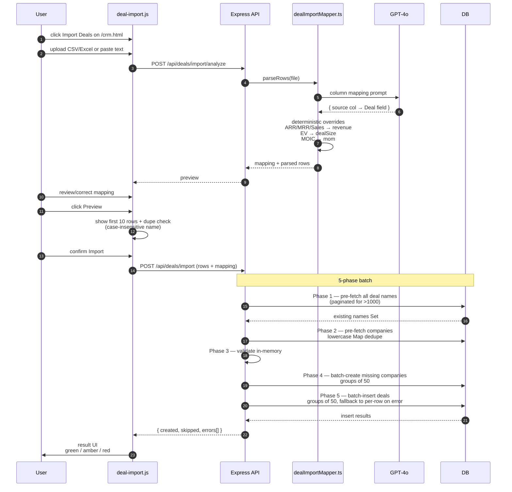

# Flow — Deal Import

Bulk-import deals from CSV / Excel / pasted text. Up to 500 deals per import; max 5 MB. Single GPT-4o call costs ~$0.01–0.02 per import.

## Sequence

## Components

| Layer | File |
| --- | --- |
| Frontend modal | [`apps/web/js/deal-import.js`](../../apps/web/js/deal-import.js) — 4-step modal: Upload → Map Columns → Preview → Result |
| Service | [`apps/api/src/services/dealImportMapper.ts`](../../apps/api/src/services/dealImportMapper.ts) — parsing, GPT-4o mapping, financial transforms, validation |
| Route | [`apps/api/src/routes/deal-import.ts`](../../apps/api/src/routes/deal-import.ts) — `POST /analyze` (mapping) + `POST /` (batch create) |
| Storage | `Deal.customFields` JSONB column captures unmapped columns |
| Mount order | `/api/deals/import` mounted in `app.ts` **before** `/api/deals` so it isn't swallowed by `:id` |

Backend (`dealImportMapper.ts`) and frontend (`deal-import.js`) both have transform logic — search for `SYNC` comments before changing one to update both.

## Determinism on top of LLM

The GPT-4o mapping is good but mismaps SaaS metrics like `ARR` or `EV` to `EBITDA`. After the LLM responds, regex patterns force-correct known columns:

- `ARR`, `MRR`, `Sales`, `Revenue` → `revenue`
- `EV`, `Enterprise Value` → `dealSize`
- `MOIC`, `MoM`, `Multiple` → `mom`

Don't remove these — they're the difference between an LLM that mostly works and one that ships.

## Result UI states

- **Full success (green):** every row imported.
- **Partial (amber):** some rows had errors; per-row error messages displayed.
- **Failure (red):** entire batch failed. Timeout-aware catch shows "Some deals may have been imported" because the request may have timed out client-side after some inserts already committed.

## Common issues

- **"Field looks like EBITDA but it's ARR."** Add the column header to the override regex in both files.
- **Duplicate deals created.** The dupe check is case-insensitive but exact-string. Trailing spaces or unicode quotes will slip through. Trim before comparing.
- **5xx after a few seconds on large imports.** Batch insert per phase already mitigates this. Check that `npm run build` redeploys `dealImportMapper.ts` — old code might be running.

## Related

- [`docs/diagrams/16-deal-import-flow.mmd`](../diagrams/16-deal-import-flow.mmd)
- [`docs/DEAL-IMPORT-TEST-GUIDE.md`](../DEAL-IMPORT-TEST-GUIDE.md)
- [`docs/superpowers/specs/2026-04-04-deal-import-design.md`](../superpowers/specs/2026-04-04-deal-import-design.md)
- [`docs/superpowers/plans/2026-04-04-deal-import.md`](../superpowers/plans/2026-04-04-deal-import.md)
