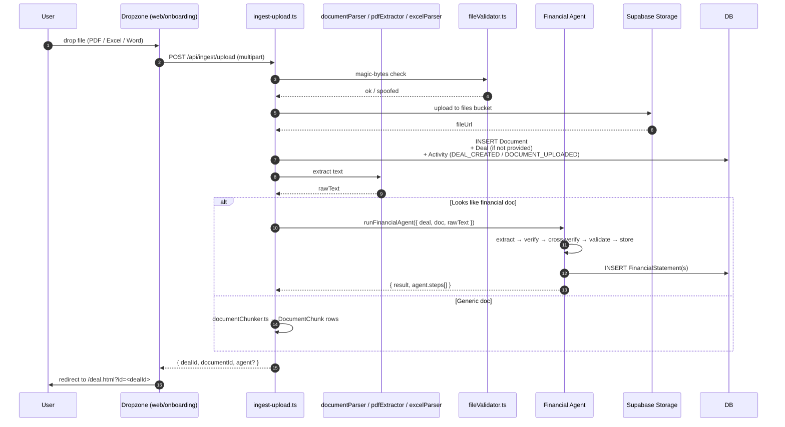

# Flow — Deal Ingest (single-deal CIM upload)

Drop a CIM, teaser, or paste a URL → PE OS auto-creates a `Deal` with extracted financials. This is the path used by the onboarding "Upload first deal" step and by the deal-detail "Add document" affordance.

## Sequence

## Entry points

| Source | Endpoint | Where it's used |
| --- | --- | --- |
| File upload | `POST /api/ingest/upload` | Onboarding dropzone, deal page upload, drop-anywhere |
| URL | `POST /api/ingest/url` | "Paste a URL" affordance |
| Email | `POST /api/ingest/email` | Email-forwarding integration |
| Pasted text | `POST /api/ingest/text` | Settings → ingest from text |
| VDR upload | `POST /api/deals/:id/documents/upload` | Inside an existing deal — does NOT auto-create a Deal |

## Validation pipeline

1. [`fileValidator.ts`](../../apps/api/src/services/fileValidator.ts) — magic-bytes check rejects spoofed MIME.
2. Body limit — Express `express.json({ limit: '50mb' })`.
3. Storage — Supabase storage bucket; signed URLs for private access.
4. [`encryption.ts`](../../apps/api/src/services/encryption.ts) for any sensitive fields persisted to columns.

## Routing by content

After parsing, ingest decides whether to invoke the Financial Agent. Heuristics:

- File looks like financial (filename contains `financial`/`income`/`balance`/`cashflow`, or extension is `.xlsx`).
- Document type explicitly set to `FINANCIAL`.
- Otherwise default to chunking into `DocumentChunk` for VDR search and let the user trigger extraction manually from the deal page.

Manual trigger lives at `POST /api/financials/extract` (see [`financial-extraction.md`](./financial-extraction.md)).

## Onboarding hook

If the request comes from the onboarding flow, the upload also fires:

- `PATCH /api/onboarding/step` — marks step 2 (`uploadDocument`) complete.
- Step 4 (`reviewExtraction`) is auto-completed by the GET-status backfill once a `FinancialStatement` row exists.

## Common issues

- **"Document uploaded but missing from VDR list."** Documents without `folderId` vanish — `documents-upload.ts` auto-assigns to a default folder. If a row escaped without `folderId`, fix it via SQL.
- **Magic-bytes rejection on a real PDF.** Check the file actually starts with `%PDF-` — some PE shops send password-protected PDFs that don't.
- **Financial Agent doesn't fire.** Check `OPENAI_API_KEY`. Without it, ingest stores the document and skips the agent silently — the user has to hit "Extract financials" manually later.
- **Circular import bug.** `ingest.ts` ↔ `ingest-upload.ts` was once circular. Fixed by extracting shared code to `ingest-shared.ts`. Don't reintroduce.

## Related

- [`docs/diagrams/17-document-ingest-pipeline.mmd`](../diagrams/17-document-ingest-pipeline.mmd)
- [`financial-extraction.md`](./financial-extraction.md)
- [`docs/features/document-management.md`](../features/document-management.md)
