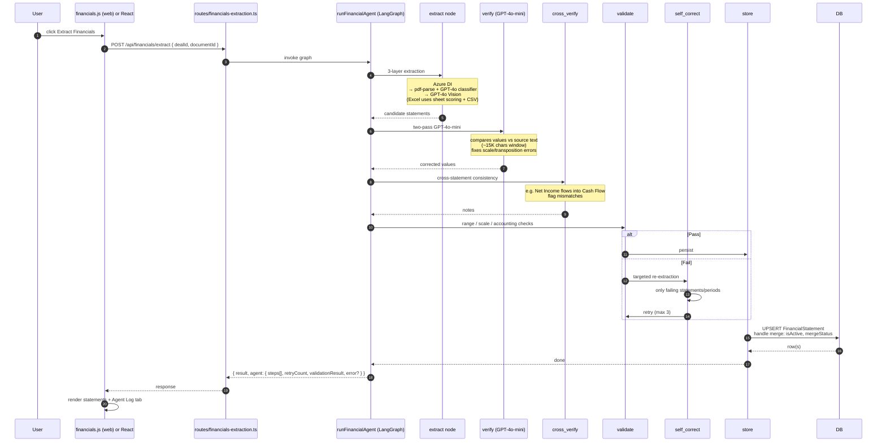

# Flow — Financial Extraction

Ingested PDF / Excel / image → structured `FinancialStatement` rows. Implemented as a 6-node LangGraph state machine (`runFinancialAgent`).

## Sequence

## Why six nodes

Each node has one job and is independently testable. Failure modes are different in each:

| Node | Common failure | Mitigation |
| --- | --- | --- |
| extract | Scanned PDF returns empty text | Vision fallback |
| verify | Source text too long | Window-trim to first 15K chars |
| cross_verify | Net Income missing in cash flow | Best-effort warning; pipeline continues |
| validate | Scale mismatch (thousands vs millions) | Self-correct routes back through validate |
| self_correct | Three retries hit | Continue to store with whatever we have, mark low confidence |
| store | Merge conflict with existing active row | Set `mergeStatus = needs_review`; expose via `/conflicts` API |

## Three-layer extraction (extract node)

1. **Azure Document Intelligence** (if `AZURE_DI_KEY` set). Best for complex CIM layouts.
2. **pdf-parse + GPT-4o classifier** ([`financialClassifier.ts`](../../apps/api/src/services/financialClassifier.ts)). Default for text-rich PDFs.
3. **GPT-4o Vision** ([`visionExtractor.ts`](../../apps/api/src/services/visionExtractor.ts)). For scanned/image-only PDFs.

Excel takes a different path entirely: [`excelFinancialExtractor.ts`](../../apps/api/src/services/excelFinancialExtractor.ts) scores each sheet (Income Statement = 100, P&L = 95, Summary = 50, junk = -1) and converts top-scored sheets to CSV before classifying.

## Multi-document merge

A deal can have multiple sources for the same period (e.g. CIM + audited financials). The DB enforces:

- `UNIQUE (dealId, statementType, period, documentId)` — one row per source per period.
- Partial unique index `WHERE isActive = true` — one **active** row per `(dealId, statementType, period)`.

When the agent stores a new row that conflicts with an active row, it sets `mergeStatus = needs_review` and exposes the conflict via:

- `GET /api/financials/conflicts`
- `POST /api/financials/resolve`
- `POST /api/financials/resolve-all`

The merge modal in `apps/web/js/financials-merge.js` lets the user pick the active row.

## Constraints to remember

- `extractionSource` must be one of `'gpt4o' | 'azure' | 'vision' | 'manual'` (DB CHECK). No compound values.
- `statementType` must be one of `'INCOME_STATEMENT' | 'BALANCE_SHEET' | 'CASH_FLOW'`. Variants like `P_AND_L` are normalised in the classifier.
- All money values stored in **millions USD**.

## Agent log UI

The `agent.steps[]` array (append-only) is rendered in the **Agent Log** tab on the deal page. Useful for debugging hallucinations or extraction quality without diving into server logs.

## Common issues

- **Numbers off by 1000×.** Scale error caught by verify on most runs. If it slipped through, the user can correct manually (sets `extractionSource = 'manual'`).
- **Verify always fails on big PDFs.** Windowing — verify only reads the first 15K chars. Make sure the financial pages are at the start, or split the PDF.
- **Self-correct loops 3 times then gives up.** Look at the `validationResult` — usually a single missing statement type. Often resolves by retrying with a clearer doc.
- **Agent crashes the request.** It shouldn't. The graph catches per-node exceptions and routes to a graceful failure state. If a request 500s, look at Sentry — almost always a missing env var (Azure / OpenAI).

## Related

- [`docs/diagrams/11-financial-extraction-pipeline.mmd`](../diagrams/11-financial-extraction-pipeline.mmd)
- [`docs/architecture/ai-agents.md#1--financial-agent`](../architecture/ai-agents.md#1--financial-agent)
- [`docs/FINANCIAL_ANALYSIS_AGENT.md`](../FINANCIAL_ANALYSIS_AGENT.md)
- [`docs/features/financial-extraction.md`](../features/financial-extraction.md)
