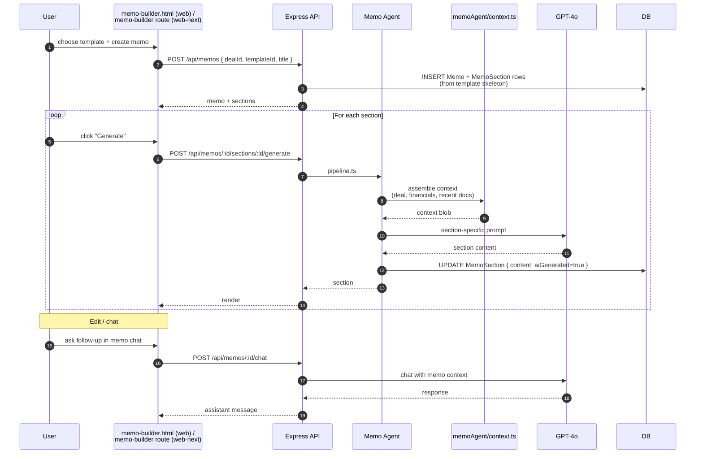

# Flow — Memo Builder

Generate an Investment Committee (IC) memo with AI-authored sections. Memos are persisted with editable section content; users can override AI text or regenerate.

## Sequence

## Components

| Layer | File |
| --- | --- |
| Frontend | [`apps/web/memo-builder.html`](../../apps/web/memo-builder.html) + `memo-builder.js` + `memo-editor.js` + `memo-sections.js` + `memo-chat.js` |
| Web-next | `apps/web-next/src/app/(app)/memo-builder/` |
| Memo Agent | [`apps/api/src/services/agents/memoAgent/`](../../apps/api/src/services/agents/memoAgent/) — `index.ts`, `pipeline.ts`, `context.ts`, `prompts.ts`, `tools.ts` |
| Routes | [`memos.ts`](../../apps/api/src/routes/memos.ts), [`memos-sections.ts`](../../apps/api/src/routes/memos-sections.ts), [`memos-chat.ts`](../../apps/api/src/routes/memos-chat.ts) |
| Templates | [`templates.ts`](../../apps/api/src/routes/templates.ts), [`templates-sections.ts`](../../apps/api/src/routes/templates-sections.ts). Org-shared in `MemoTemplate`. |
| DB | `Memo`, `MemoSection`, `MemoTemplate`. Section types: 12 (Executive Summary, Investment Thesis, Market Analysis, Financial Performance, Risks, etc.). `aiGenerated` boolean flags AI-authored content. |

## Section types

12 types are defined in `prompts.ts`. Each gets its own prompt that knows what data to ground in (financials for "Financial Performance", risks for "Risk Factors", etc.). The prompts cite the deal context explicitly, so they don't hallucinate metrics.

## Rate limiting

Memo generation and chat hit the AI bucket (10 / min / user). `app.ts` mounts AI rate-limit on:

- `/api/ai`
- `/api/memos/*/chat`
- `/api/memos/*/sections/*/generate`

If a user is blasting through generations, they'll hit 429. The frontend should debounce.

## Common issues

- **Section regenerates with stale data.** Context is assembled fresh every call from `memoAgent/context.ts` — but caching may surface here later. If a user edits the deal then regenerates a section, the new context should reflect the edit.
- **Hallucinated numbers in "Financial Performance".** If the deal has no `FinancialStatement` rows, the prompt should say so and ask the user to extract first. Make sure the financial table block is in `context.ts` output.
- **Empty memo on creation.** The template skeleton is `MemoTemplate.sections` JSONB. Create the template first if blank; existing org-shared templates seed sections automatically.

## Related

- [`docs/diagrams/04-memo-builder-flow.mmd`](../diagrams/04-memo-builder-flow.mmd)
- [`docs/architecture/ai-agents.md#3--memo-agent`](../architecture/ai-agents.md#3--memo-agent)
- [`docs/features/memo-builder.md`](../features/memo-builder.md)
