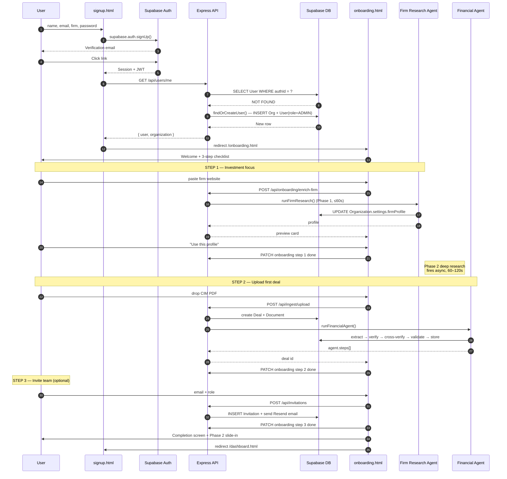

# Flow — Signup & Onboarding

A first-time user goes from `signup.html` to having a deal in the pipeline with extracted financials. The whole loop targets ~5 minutes.

## Sequence

## Components

| Layer | File / endpoint | Notes |
| --- | --- | --- |
| Signup form | [`apps/web/signup.html`](../../apps/web/signup.html) | Name, email, firm, password (Title was removed) |
| Auth | Supabase | Email-link verification; password reset via `forgot-password.html` |
| Auto-provision | [`services/userService.ts`](../../apps/api/src/services/userService.ts) `findOrCreateUser()` | Called on first authenticated request. Creates `Organization` from `firmName` + `User(role=ADMIN)` |
| Welcome modal | [`apps/web/js/onboarding/onboarding-welcome.js`](../../apps/web/js/onboarding) | First load of dashboard if `onboardingStatus.welcomeShown` is false |
| Standalone onboarding | [`apps/web/onboarding.html`](../../apps/web/onboarding.html) + `onboarding-flow.js` + `onboarding-tasks.js` | 3-step flow: focus → upload → invite |
| Firm Research Agent | [`services/agents/firmResearchAgent/`](../../apps/api/src/services/agents/firmResearchAgent/) | Phase 1 sync (≤60s) + Phase 2 async deep research (60–120s). Stores to `Organization.settings.firmProfile` |
| Persistent checklist | [`apps/web/js/onboarding/onboarding-checklist.js`](../../apps/web/js/onboarding/) | Sidebar widget on dashboard / CRM / contacts |
| Backend status | `GET /api/onboarding/status` | Auto-backfills 5 steps from real activity (Deal/Document/FinancialStatement/ChatMessage/Invitation existence checks) |

## What "complete" means for each step

The 5 onboarding steps map to data:

| Step | Backfill check |
| --- | --- |
| Define investment focus | `Organization.settings.firmProfile` exists |
| Create first deal | At least one `Deal` in org |
| Upload document | At least one `Document` in any deal |
| Review extraction | At least one `FinancialStatement` row |
| Try AI chat | At least one `ChatMessage` row |

Manual completion: clicking the empty circle in the checklist marks a step done (forward-only).

## Common issues

- **User shows blank dashboard after signup.** Auth UUID mismatch — frontend has Supabase user UUID, but the API hasn't matched it to a `User` row. Hit `/api/users/me` to trigger `findOrCreateUser()`.
- **Firm enrichment never returns.** Check Apify quota / `APIFY_API_TOKEN`. Falls back to DDG Lite if Apify fails. Phase 1 hard-times-out at 60s.
- **Phase 2 deep research never appears.** Frontend polls `GET /api/onboarding/research-status`; check that polling is happening on the dashboard route.
- **Welcome modal re-appears after dismissal.** `PATCH /api/onboarding/welcome-shown` must succeed to flip the JSONB flag.

## Related

- [`docs/diagrams/14-onboarding-flow.mmd`](../diagrams/14-onboarding-flow.mmd)
- [`docs/diagrams/15-firm-research-agent.mmd`](../diagrams/15-firm-research-agent.mmd)
- [`docs/diagrams/sample-auth-flow.mmd`](../diagrams/sample-auth-flow.mmd)
- [`docs/features/onboarding.md`](../features/onboarding.md)
