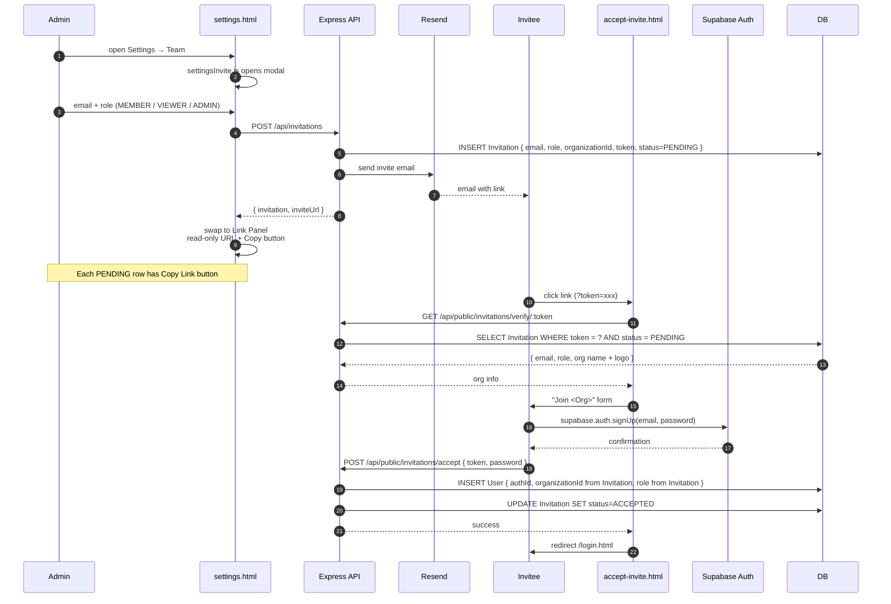

# Flow — Team Invitation

Admin invites a teammate. Invitee creates an account that lands them in the same Organization with the assigned role.

## Sequence

## Components

| Layer | File / endpoint |
| --- | --- |
| Settings UI | [`apps/web/js/settingsInvite.js`](../../apps/web/js/settingsInvite.js) — modal + invitation list with `#section-team` nav |
| Modal flow | Two-panel: form panel (email + role) → link panel (read-only invite URL + Copy). Footer Done / Invite Another. Auto-opens on `#invite` hash |
| Copy helper | `navigator.clipboard.writeText` with `document.execCommand('copy')` fallback for non-HTTPS contexts. Shows green "Copied" feedback for 1.5s |
| Authenticated invite mgmt | [`routes/invitations.ts`](../../apps/api/src/routes/invitations.ts) — list, create, revoke, resend |
| Public verify/accept | [`routes/invitations-accept.ts`](../../apps/api/src/routes/invitations-accept.ts) — mounted under `/api/public/invitations` |
| Email | [`services/userService.ts`](../../apps/api/src/services/userService.ts) (Resend) |
| Schema | `Invitation { email, role, organizationId, token unique, status: PENDING/ACCEPTED/EXPIRED/REVOKED, invitedBy }` |

## API behaviour worth knowing

- `POST /api/invitations` always returns `inviteUrl`. Earlier behaviour returned it only on email failure — now it's always present so the admin can copy/paste.
- `GET /api/invitations` decorates each PENDING row with `inviteUrl`; tokens are stripped from accepted/expired rows.
- The verify endpoint is **public** because the invitee has no account yet.
- The accept endpoint creates the `User` row with the role and organizationId from the `Invitation` — the invitee can't pick their own org.

## Common issues

- **"Email failed but invite created"** — Resend may be unconfigured. The `inviteUrl` in the response is the fallback; the admin can hand it over manually.
- **Wrong org after accept** — only happens if `Invitation.organizationId` was set wrong on creation. Verify the admin's `req.organizationId` matched expectations.
- **Stale tokens** — invitations have a status; expired/revoked rows don't have `inviteUrl` exposed.

## Related

- [`docs/diagrams/sample-auth-flow.mmd`](../diagrams/sample-auth-flow.mmd) — full auth flow including invitation
- [`docs/features/invitations-and-team.md`](../features/invitations-and-team.md)
