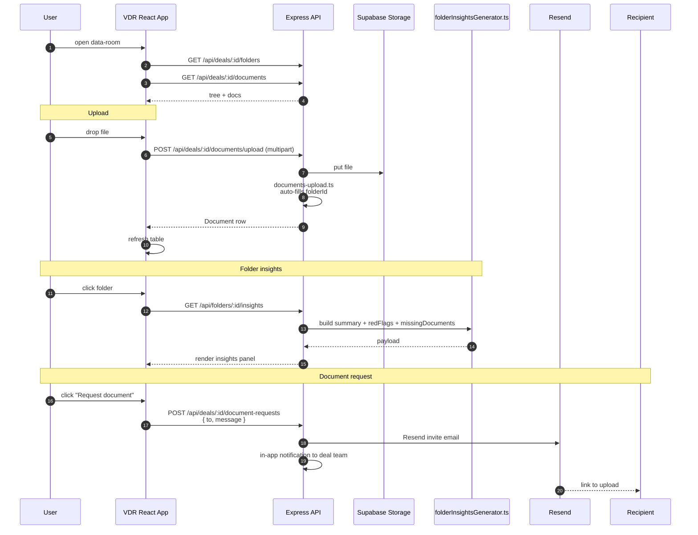

# Flow — VDR & Document Management

The Virtual Data Room (VDR) is a React sub-app that ships inside both `apps/web` (legacy host) and `apps/web-next` (primary). Folder-tree on the left, file table in the middle, AI insights panel on the right.

## Sequence

## Components

| Layer | File |
| --- | --- |
| Entry | [`apps/web/src/vdr.tsx`](../../apps/web/src/vdr.tsx) → built by Vite to `apps/web/dist/assets/vdr-*.js`. Reused inside `apps/web-next/src/components/vdr/` |
| Components | `FolderTree`, `FiltersBar`, `FileTable`, `InsightsPanel`, `ConfirmDialog`, `Toast` |
| API service | [`apps/web/src/services/vdrApi.ts`](../../apps/web/src/services/vdrApi.ts) — VDR API calls + transforms |
| Smart filters | 4 built-in (PDFs, Spreadsheets, AI Warnings, Last 30 Days) + 7 custom presets in `FiltersBar.tsx` |
| Cross-folder search | typing in search bar searches all folders; blue banner with result count + clear button |
| Dialog system | `ConfirmDialog` (3 variants: danger / warning / info) + `ToastContainer` (4 variants). Replaces `window.confirm()` / `alert()`. Managed via `showConfirm()` / `showToast()` helpers |

## Folders

Self-referential tree (`Folder.parentId`). Sort via `sortOrder`. `isRestricted` toggles RBAC gating.

## Folder insights

Generated by [`folderInsightsGenerator.ts`](../../apps/api/src/services/folderInsightsGenerator.ts). Output:

- `summary` — 1-paragraph overview
- `completionPercent` — coverage of expected document categories
- `redFlags` — string[] of concerns
- `missingDocuments` — string[] of suggested follow-ups

Cached in `FolderInsight` rows; regenerated on demand.

## Document request flow

`POST /api/deals/:id/document-requests`:

1. Sends a Resend email to the recipient with a magic link.
2. Creates an in-app `Notification` for everyone on the deal team.
3. Logs an `Activity` row of type `DOCUMENT_REQUESTED`.

Recipients without accounts upload via the public link; the invite verifies access by token, not by user.

## Smart filters

Built-in:

- Show only PDFs
- Show only Spreadsheets
- AI Warnings (documents flagged by Folder Insights)
- Last 30 Days

Custom presets (added via "+ Custom" dropdown):

- Word Docs
- Large Files (> 10 MB)
- Small Files (< 100 KB)
- Last 7 Days / Last 90 Days
- AI Analyzed
- Pending Analysis

Removed via "x" on the chip.

## Common issues

- **Documents missing from list.** Check `Document.folderId` is not null. `documents-upload.ts` auto-assigns to a default folder; old rows uploaded without folder are invisible.
- **Dropdowns clipped.** `overflow-x-auto` on a parent clips absolutely-positioned dropdowns. Use `flex-wrap` instead.
- **Sticky table columns become transparent.** Use solid hex backgrounds via `style` attribute, not Tailwind classes (which can be transparent or overridden).
- **Real-data only.** All mock data overlay was removed in Session 28. `useMockData = false` everywhere.

## Related

- [`docs/diagrams/03-document-vdr-flow.mmd`](../diagrams/03-document-vdr-flow.mmd)
- [`docs/diagrams/17-document-ingest-pipeline.mmd`](../diagrams/17-document-ingest-pipeline.mmd)
- [`docs/features/vdr.md`](../features/vdr.md)
- [`apps/web/VDR_README.md`](../../apps/web/VDR_README.md)
